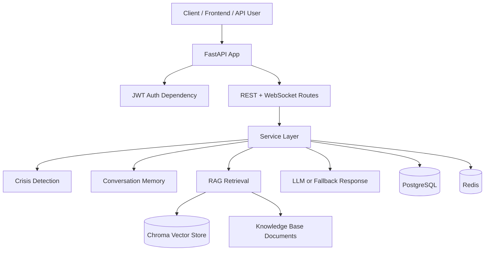
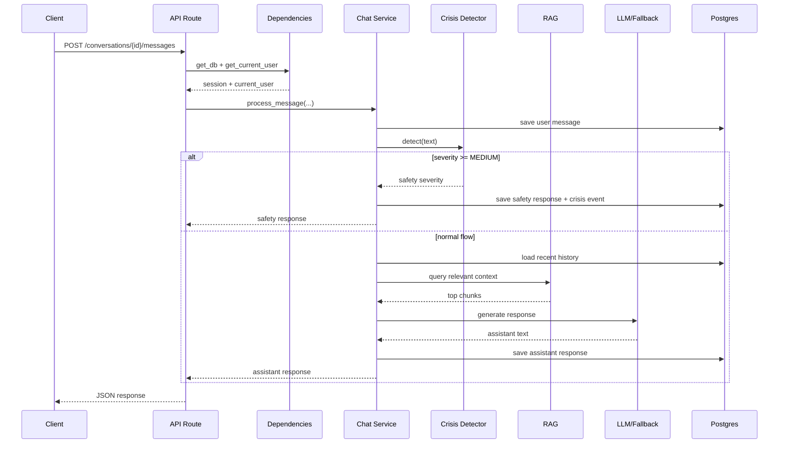
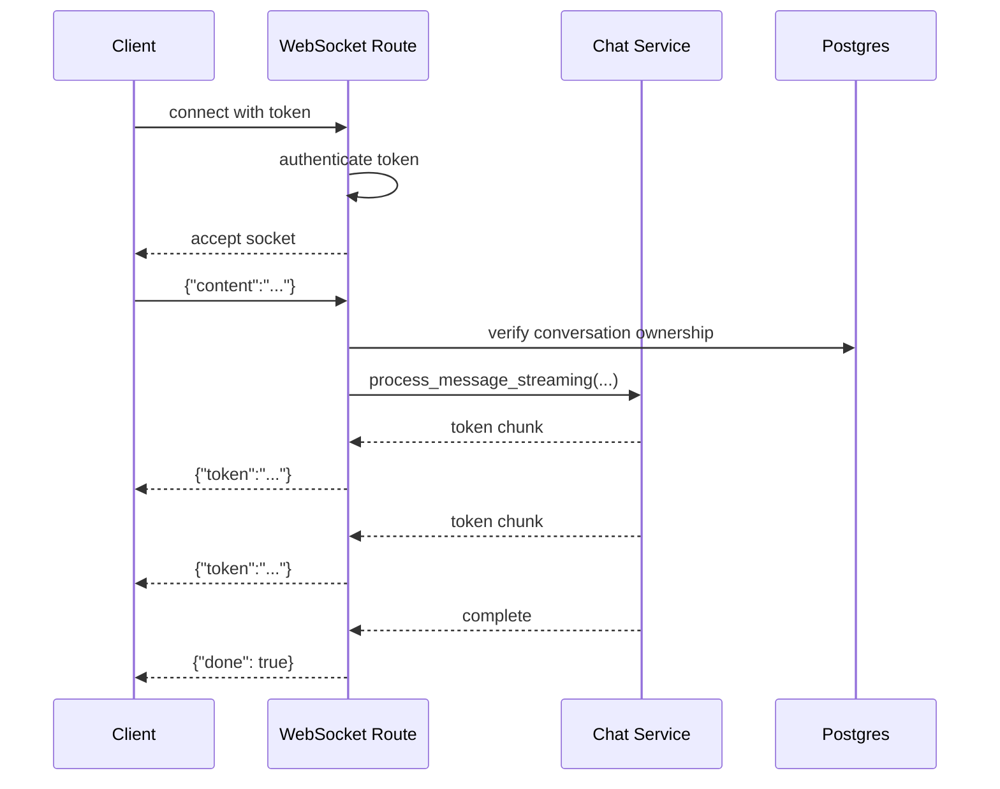

# LEARN.md

This document is your interview prep companion for the `AI Conversational Platform` project.

Goal: make you ready to explain this project clearly in:

- technical interviews
- backend interviews
- system design rounds
- project walkthroughs
- resume deep-dives
- "why did you build it this way?" questions

This is not just a project summary. It teaches:

- what the system does
- how the system works
- why each major choice was made
- where the design is strong
- where the design is weak
- what you would improve next
- how to answer interview questions with confidence

---

## 1. One-Sentence Project Summary

This project is a backend-first conversational support platform built with FastAPI, PostgreSQL, Redis, JWT authentication, WebSockets, crisis detection, and optional AI/RAG integration for supportive chat responses.

Shorter version:

> I built a FastAPI-based conversational backend with authentication, persistent chat history, crisis detection, and both REST and WebSocket messaging, with optional LLM-powered responses and a safe fallback mode when AI is unavailable.

---

## 2. What Problem Does This Project Solve?

At a product level, this project tries to support users who want a conversational interface for guidance and emotional support.

The system has to do more than just "chat":

- it must authenticate users
- it must store conversations and messages
- it must stream responses in real time
- it must detect crisis-like language and override normal chat behavior with safety messaging
- it must stay usable even if external AI providers are unavailable

That last point is especially important for interview discussion:

> This is not just an AI wrapper. It is a backend system with state, safety rules, persistence, and multiple runtime modes.

---

## 3. High-Level Architecture

Think of the system as 7 layers:

1. **API layer**
  - FastAPI routes
  - REST endpoints
  - WebSocket endpoint
2. **Dependency/auth layer**
  - DB session injection
  - Redis injection
  - current-user resolution from JWT
3. **Service layer**
  - auth logic
  - conversation logic
  - chat orchestration
  - crisis detection
4. **AI layer**
  - prompts
  - memory building
  - RAG retrieval
  - LLM streaming
5. **Persistence layer**
  - SQLAlchemy models
  - PostgreSQL storage
  - Alembic migrations
6. **Infrastructure/runtime layer**
  - Docker Compose
  - Postgres
  - Redis
  - app container
7. **Safety layer**
  - keyword crisis detection
  - optional semantic crisis detection
  - safety-response override path

---

## 4. Folder-by-Folder Breakdown

### `app/main.py`

This is the FastAPI entry point.

What it does:

- creates the app object
- registers routers
- configures CORS
- installs a rate-limit exception handler
- exposes `/health`
- initializes the RAG engine during app startup

Why it matters:

- It is the composition root of the application.
- In interviews, this shows where startup lifecycle and app wiring live.

Important concept:

- **lifespan hook**: FastAPI allows startup/shutdown behavior using an async context manager.
- Here it is used to initialize RAG at app boot.

Tradeoff:

- initializing RAG on startup improves first-request latency
- but it can make startup slower or fail if AI/vector dependencies are broken

Good interview phrase:

> I used the lifespan hook to pre-initialize the retrieval layer so the system fails early and the first user request is not burdened with index startup cost.

### `app/api`

This is the transport layer.

Files:

- `auth.py`
- `conversations.py`
- `messages.py`
- `websocket.py`

What this layer should do:

- parse input
- call dependencies
- delegate to services
- return structured responses

What it should not do:

- heavy business logic
- direct architecture decisions
- large amounts of DB orchestration

This separation is good to mention in interviews:

> I kept HTTP concerns in the API layer and business behavior in the service layer.

### `app/services`

This is the heart of the backend.

Files:

- `auth_service.py`
- `conversation_service.py`
- `chat_service.py`
- `crisis_service.py`
- `session_service.py`

This layer contains the actual use cases:

- create user token
- verify passwords
- create conversations
- persist messages
- detect crisis severity
- orchestrate the chat flow

Interview framing:

> The service layer is where I encoded application behavior so routes stay thin and the logic is easier to test.

### `app/ai`

This is the AI integration layer.

Files:

- `chain.py`
- `rag.py`
- `memory.py`
- `prompts.py`

Responsibilities:

- prompt construction
- chat history conversion
- retrieval over knowledge base
- response streaming
- fallback mode when no valid OpenAI key exists

Key insight:

This project is designed so AI is an optional capability, not the entire system.

That is a strong interview point.

### `app/models`

This defines database entities.

Core tables:

- `User`
- `Conversation`
- `Message`
- `CrisisEvent`

These represent the domain model of the application.

### `app/database.py`

This is the SQLAlchemy async engine and session factory.

Concepts here:

- connection pooling
- lazy singleton engine creation
- async session factory
- dependency-friendly session generator

### `app/dependencies.py`

This is where shared FastAPI dependencies live:

- DB access
- Redis access
- current user resolution

This is where token authentication becomes request-scoped user identity.

### `alembic`

This manages schema migrations.

Concept:

- SQLAlchemy models define what the app expects
- Alembic migrations define how the database evolves safely over time

### `docker-compose.yml`

This is your local environment orchestration.

Services:

- `app`
- `frontend`
- `db`
- `redis`

Interview phrase:

> Docker Compose gave me a reproducible development environment so the backend, database, and cache could run with stable networking and health checks.

---

## 5. Core Backend Request Flow

Let us walk through a normal authenticated REST request.

Example:

`POST /conversations/{id}/messages`

Flow:

1. Request hits FastAPI route.
2. FastAPI parses JSON body.
3. `Depends(get_db)` provides an async DB session.
4. `Depends(get_current_user)` extracts the Bearer token.
5. JWT is decoded.
6. User row is loaded from Postgres.
7. Route verifies conversation ownership.
8. Route delegates to `chat_service.process_message()`.
9. Service saves the user message.
10. Service runs crisis detection.
11. If crisis severity is high enough, it returns a safety response.
12. Otherwise it performs RAG retrieval.
13. Then it calls LLM response generation or fallback mode.
14. Assistant response is saved.
15. Response is returned to the client.

What to say in an interview:

> The request path combines auth, persistence, safety checks, optional retrieval, and response generation in a predictable sequence. The service layer is where that orchestration happens.

---

## 6. Authentication: What, Why, When, Where

### What is used?

- JWT bearer authentication
- bcrypt password hashing

### Where is it implemented?

- route handlers: `app/api/auth.py`
- hashing/token helpers: `app/services/auth_service.py`
- request auth dependency: `app/dependencies.py`

### Why JWT?

JWT is useful because:

- it is stateless
- it is simple to use across REST and WebSocket flows
- it avoids server-side session lookup for basic auth

### When is JWT a good choice?

It is good when:

- you need simple API auth
- you want clients to carry their own access token
- you do not need sophisticated session revocation yet

### Where does JWT become weaker?

Weak points:

- logout is not true invalidation unless you track tokens server-side
- revocation is harder
- refresh-token flows add complexity
- stolen tokens remain valid until expiry

### How password hashing works

Passwords are never stored in plaintext.

Flow:

1. user sends password
2. backend hashes password with bcrypt
3. hash is stored
4. on login, bcrypt compares plaintext to stored hash

Why bcrypt?

- it is intentionally slow
- slow hashing helps resist brute-force attacks

Good interview answer:

> I used bcrypt because password hashing should be computationally expensive. That makes large-scale brute-force attacks significantly harder than if I had used a fast general-purpose hash.

### Current auth limitations

Be honest and confident:

- no refresh tokens
- no revocation list
- no role-based authorization
- no MFA
- no audit trail

Best phrasing:

> I optimized for simplicity first. If this moved toward production, I would add refresh tokens, token rotation, role-based permissions, and server-side revocation support.

---

## 7. Database Design: What and Why

### Entities

#### User

Represents an account.

Key fields:

- `id`
- `email`
- `hashed_password`
- `is_active`
- timestamps

#### Conversation

Represents a chat thread owned by one user.

Why separate conversation from message?

- a user has many conversations
- each conversation has many messages
- separation makes querying, ordering, deletion, and ownership easier

#### Message

Represents one message in a conversation.

Key fields:

- `conversation_id`
- `role` (`user` or `assistant`)
- `content`
- `tokens_used`
- timestamp

#### CrisisEvent

Represents a safety-relevant detection event.

Why store this separately?

- allows auditability
- allows future moderation/review workflows
- keeps safety metadata separate from plain chat content

### Why UUIDs?

UUIDs are used for IDs.

Benefits:

- globally unique
- harder to guess than sequential IDs
- safer for exposed APIs

Tradeoff:

- larger than integers
- somewhat worse for index locality/performance in some databases

Good interview framing:

> I chose UUIDs because they are safer to expose through APIs and avoid predictable sequential identifiers, which is valuable for multi-tenant user data.

### Relationships

- one user -> many conversations
- one conversation -> many messages
- one user -> many crisis events
- one crisis event may reference a message

### Cascading delete

If a user is deleted, their conversations and dependent messages can also be deleted through relational cascade behavior.

Why this matters:

- avoids orphaned rows
- keeps referential integrity clean

---

## 8. SQLAlchemy + Async Sessions

### What is SQLAlchemy doing here?

SQLAlchemy acts as the ORM and query builder.

That means:

- Python classes represent tables
- Python expressions generate SQL
- async sessions handle DB interaction

### Why async?

FastAPI works very well with async I/O.

Database and network calls are I/O-bound, so async helps:

- improve concurrency
- avoid blocking the server thread during waits

### Important concept: session lifecycle

`get_db()` yields a DB session per request.

Why that is good:

- sessions are scoped cleanly
- you avoid leaking long-lived request sessions
- rollback/commit boundaries become easier to reason about

### Pooling settings

The engine uses:

- `pool_pre_ping=True`
- `pool_size`
- `max_overflow`

Meaning:

- pre-ping checks if a DB connection is still alive before using it
- pool_size controls baseline open connections
- max_overflow allows temporary extra connections under load

Interview-ready explanation:

> I used connection pooling because opening a new database connection per request is expensive. Pooling improves performance and stability under concurrent traffic.

---

## 9. Alembic and Migrations

### What is a migration?

A migration is a versioned database schema change.

### Why use Alembic?

Because changing ORM models is not enough.

If you change Python models without changing the real DB schema:

- the app and database drift apart
- runtime failures happen

### In this project

You have:

- initial schema migration
- follow-up migration for server defaults

### Why this matters in interviews

This shows you understand:

- schema evolution
- backward compatibility
- deployment safety

Good answer:

> I used Alembic so schema changes are explicit, reviewable, and reproducible across environments instead of relying on manual database edits.

---

## 10. WebSockets: What, Why, When, Where

### What are WebSockets?

WebSockets are persistent full-duplex connections between client and server.

Unlike normal HTTP:

- the connection stays open
- server and client can send messages repeatedly

### Why use WebSockets here?

Because chat streaming feels better when tokens arrive incrementally instead of waiting for one giant HTTP response.

### Where is it implemented?

- `app/api/websocket.py`

### Flow

1. client connects to a conversation-specific endpoint
2. server authenticates the token
3. client sends JSON with content
4. server validates input
5. chat service yields token chunks
6. server sends each chunk back
7. server sends `done=true`

### Why not use normal REST for streaming?

Possible reasons:

- WebSockets fit bidirectional conversational UX naturally
- lower overhead for repeated message exchange
- better model for chat apps than polling

### Design tradeoffs

Strengths:

- good UX
- natural for streaming
- conversation-specific channels are simple

Weaknesses:

- more stateful than normal REST
- horizontal scaling gets harder
- token-in-query auth is operationally weaker
- no broadcast manager or pub/sub layer yet

### Strong interview answer

> I used REST for standard CRUD-style operations and WebSockets for streaming chat because the transport choice matches the interaction pattern: request/response for management actions, persistent bidirectional communication for live chat.

---

## 11. Crisis Detection: One of the Most Important Parts

This is the strongest product/architecture talking point in the repo.

### What does it do?

It detects dangerous or high-risk user messages and overrides normal AI chat with safety responses.

### Why is that important?

Because for support-oriented chat systems, safety must be a first-class system behavior, not an afterthought.

### How does it work?

Two stages:

1. **keyword detection**
2. **semantic detection**

### Keyword detection

The system checks message text for known phrases grouped by severity:

- `LOW`
- `MEDIUM`
- `HIGH`
- `CRITICAL`

Why keyword detection is useful:

- fast
- predictable
- cheap
- easy to reason about

Weakness:

- brittle
- users can express dangerous intent without matching exact phrases

### Semantic detection

The project optionally uses embeddings to compare the input message against reference crisis phrases.

Why semantic matching exists:

- catches intent even when wording differs

Weakness:

- more expensive
- depends on external provider
- can produce false positives/negatives

### Important system behavior

If severity is `MEDIUM`, `HIGH`, or `CRITICAL`:

- the LLM path is skipped
- a predefined safety response is returned
- a crisis event is logged

This is very interview-worthy.

Best way to say it:

> I intentionally short-circuited the LLM path for serious crisis detections. That reduces the risk of an unsafe or inconsistent generated response when the system should instead respond with deterministic safety guidance.

### Honest limitation

The semantic path recomputes reference embeddings at runtime instead of caching them.

That is a real optimization opportunity.

Say:

> The current semantic crisis detection works, but it is not cost-efficient. A production version should precompute and cache reference embeddings instead of recomputing them per request.

---

## 12. RAG: What, Why, When, Where

### What is RAG?

RAG means **Retrieval-Augmented Generation**.

It is a pattern where you:

1. retrieve relevant knowledge from a store
2. inject it into the prompt
3. ask the model to answer using that context

### Why use RAG here?

Because pure LLM answers may:

- hallucinate
- ignore project-specific knowledge
- miss curated support material

RAG makes the response more grounded in the project's knowledge base.

### Where is it implemented?

- retrieval engine: `app/ai/rag.py`
- prompt integration: `app/ai/chain.py`

### What tools are used?

- LlamaIndex
- ChromaDB
- OpenAI embeddings

### How it works in this project

1. documents are loaded from `knowledge_base/documents`
2. they are split into chunks
3. embeddings are created
4. embeddings are stored in Chroma
5. when a user asks something, top matching chunks are retrieved
6. retrieved text is appended to the system prompt

### Why chunk documents?

Because embeddings work better on semantically focused pieces of text than huge files.

### Why a vector store?

Because semantic similarity search is much better than exact keyword matching for natural language retrieval.

### Good interview answer

> I used RAG so the assistant can ground responses in curated internal knowledge rather than relying only on the model’s pretrained memory.

### Important limitation

When no valid AI key exists:

- RAG initialization may fail
- the app falls back gracefully

That is a reliability feature.

---

## 13. LLM Integration and Fallback Mode

### Normal mode

When a valid OpenAI key is configured:

- messages are turned into LangChain message objects
- a system prompt is built
- optional RAG context is added
- streaming response comes from the model

### Fallback mode

When no usable key is configured:

- the app returns a deterministic supportive message
- backend still works
- interviews/demo usage still works

### Why fallback mode is a smart design choice

Because external AI providers are dependencies, and dependencies fail.

Fallback mode improves:

- demo reliability
- development experience
- interview readiness
- partial system availability

Great interview line:

> I designed the system so AI is an enhancement rather than a hard dependency. If the model provider is unavailable, the backend still behaves correctly and returns a safe fallback response.

---

## 14. Memory and Conversation History

### What is memory here?

Not long-term memory in the human sense.

It is simply the recent conversation context passed back into the LLM.

### How is it done?

- fetch recent messages from Postgres
- convert them into LLM message objects
- include them in the prompt

### Why only recent messages?

Because:

- full history is expensive
- context windows are limited
- recent turns are usually the most relevant

### Current choice

- last 10 messages

### Tradeoff

Pros:

- fast
- simple
- enough for short conversations

Cons:

- older context can be lost
- long-running conversations may degrade in coherence

---

## 15. Rate Limiting

### What is rate limiting?

Rate limiting controls how often a client can call the API in a time window.

### Why is it useful?

- protects against abuse
- reduces accidental overload
- improves resilience

### In this project

The limiter object and exception handler exist.

But an important interview point:

> The current design appears only partially wired. The limiter is configured, but route-level enforcement is not fully applied yet.

This is exactly the kind of honest engineering answer interviewers appreciate.

Do not pretend it is more complete than it is.

---

## 16. Redis: Why It Exists Here

Redis is configured and injectable, but it is not deeply central to the current hot path.

### What Redis is good for

- caching
- ephemeral sessions
- rate limiting state
- pub/sub
- task coordination

### In this project

Redis is available through dependency injection and there is a `session_service.py`, but the current primary backend flow relies mostly on Postgres plus JWT.

Good interview phrasing:

> Redis is provisioned as a strategic runtime dependency for caching/session-like features, but the current backend does not yet exploit it heavily in the main request path.

---

## 17. Docker and Runtime Concepts

### Why Docker Compose?

Because modern backend apps usually depend on multiple services:

- app server
- database
- cache
- sometimes frontend

Compose allows:

- reproducible startup
- consistent ports
- service names for networking
- health checks

### What to understand deeply

#### Container

A lightweight packaged runtime for an application.

#### Service

A named running component in Compose.

#### Volume

Persistent storage outside the container lifecycle.

#### Health check

A periodic check that tells Compose whether the service is truly ready.

### Why health checks matter

Just because a container has started does not mean the service is ready.

Example:

- Postgres process started
- but it is not yet ready to accept connections

Health checks help coordinate startup order.

### Good answer

> I used health checks so dependent services wait for actual readiness rather than only process startup.

---

## 18. Strong Design Decisions in This Project

These are your "sell this project well" points.

### 1. Thin API, service-layer orchestration

Good separation of transport vs business logic.

### 2. Crisis short-circuit before LLM

This is a strong safety architecture decision.

### 3. Backend still usable without AI key

This shows reliability thinking.

### 4. Both REST and WebSocket support

You demonstrate understanding of transport tradeoffs.

### 5. DB-backed persistence with migrations

This is more mature than toy demos.

### 6. Curated knowledge base + vector retrieval

Shows familiarity with practical AI architecture, not just raw prompting.

---

## 19. Weak Spots and How to Talk About Them

Interviewers love asking:

> What would you improve?

Have a crisp answer.

### Weak spot 1: auth is basic

Current:

- access token only
- no refresh tokens
- no revocation

Improvement:

- refresh tokens
- token rotation
- logout invalidation
- audit logging

### Weak spot 2: WebSocket auth via query param is convenient but weaker

Improvement:

- rely on more secure header/subprotocol strategy only
- add stricter operational guidance

### Weak spot 3: no transaction boundary for whole chat flow

Current:

- user message can be saved even if assistant generation fails later

This is not always wrong, but you should understand the implication.

Improvement:

- use clearer transactional boundaries
- or model incomplete assistant generation explicitly

### Weak spot 4: semantic crisis detection is expensive

Improvement:

- cache reference embeddings
- reduce per-request cost

### Weak spot 5: Redis is underused

Improvement:

- conversation caching
- rate-limit storage
- pub/sub for multi-instance streaming

### Weak spot 6: rate limiting not fully enforced

Improvement:

- apply per-route decorators or middleware consistently

### Weak spot 7: no observability stack

Improvement:

- structured logging
- metrics
- tracing
- error dashboards

### Best way to say this in interviews

> I deliberately built the core architecture first. The next phase would harden it with better auth lifecycle management, stronger observability, more efficient semantic detection, and better multi-instance WebSocket scaling.

---

## 20. What You Should Say If Asked "Why FastAPI?"

Good answer:

> I chose FastAPI because it gives me async support, strong request validation through Pydantic, automatic OpenAPI docs, and a clean dependency-injection model. That makes it a strong fit for backend APIs that mix normal CRUD operations with real-time and AI-adjacent workflows.

Expanded answer:

- async-friendly
- strong typing
- automatic docs
- fast to build and test
- excellent for REST + WebSocket combination

---

## 21. What You Should Say If Asked "Why PostgreSQL?"

Answer:

> I used PostgreSQL because the application has clear relational structure: users own conversations, conversations contain messages, and crisis events reference users and messages. That kind of integrity and query pattern fits a relational database very well.

Why not NoSQL here?

- relationships are important
- consistency matters
- schema is structured

---

## 22. What You Should Say If Asked "Why Redis?"

Answer:

> Redis is a useful low-latency support system for caching, rate limiting, and ephemeral state. Even though the current version does not depend on it heavily for the main chat path, I included it because it is the right infrastructure piece for scaling session-like and real-time features later.

---

## 23. What You Should Say If Asked "Why WebSocket Instead of SSE?"

Strong answer:

> I chose WebSockets because chat is naturally bidirectional. SSE is great for server-to-client streaming, but WebSockets are a better fit if I want the same persistent connection to support multiple live interactions, richer message types, or future real-time collaborative features.

Tradeoff acknowledgment:

> If I only needed one-way token streaming, SSE could be simpler operationally.

That nuance makes you sound strong.

---

## 24. Interview Question Bank With Model Answers

### Q1. Walk me through the architecture.

Model answer:

> The backend is built in FastAPI. Routes stay thin and delegate to services. Authentication is JWT-based, with passwords hashed using bcrypt. Conversations and messages are persisted in PostgreSQL using SQLAlchemy async sessions, and schema changes are managed through Alembic migrations. For chat, the system first saves the user message, runs crisis detection, and either returns a deterministic safety response or proceeds into RAG retrieval plus LLM generation. For real-time UX, there is also a WebSocket endpoint that streams response chunks back to the client.

### Q2. What is the most interesting technical part?

Model answer:

> The most interesting part is the crisis-detection short-circuit. I designed the system so that potentially dangerous messages bypass the normal AI generation path and return a controlled safety response. That was important because safety behavior should be deterministic in high-risk situations.

### Q3. What tradeoffs did you make?

Model answer:

> I optimized for a strong core architecture first rather than a fully productionized auth and observability stack. So the system has a clean service-oriented backend, persistence, WebSockets, crisis routing, and RAG, but it still needs upgrades like refresh tokens, stronger WebSocket auth discipline, cached semantic embeddings, and more complete rate-limit enforcement.

### Q4. How would you scale this?

Model answer:

> I would separate concerns more aggressively. For example, move expensive semantic detection or retrieval preprocessing out of the hot path, add Redis-backed pub/sub or a dedicated connection manager for multi-instance WebSockets, introduce background jobs for heavy AI tasks, and add proper observability so we can see latency, error rates, and provider failures clearly.

### Q5. What happens if OpenAI goes down?

Model answer:

> The backend still works. I added fallback behavior so the API remains functional and returns deterministic supportive guidance instead of failing completely. That keeps the system usable during provider outages or in environments where no AI key is configured.

### Q6. Why did you store both conversations and messages?

Model answer:

> Because conversations are the parent organizational unit and messages are the atomic content records. Separating them makes ownership, pagination, deletion, and retrieval much cleaner than if everything were flattened into a single message table without thread structure.

### Q7. What would you improve first?

Model answer:

> First I would harden auth and reliability. That means refresh tokens, token invalidation strategy, stronger rate-limit enforcement, better transaction boundaries in the chat flow, and caching for semantic crisis detection reference embeddings.

---

## 25. Resume-Friendly Talking Points

Use these in resume bullets or interviews:

- Built a FastAPI-based conversational backend with JWT auth, PostgreSQL persistence, and WebSocket streaming.
- Designed a safety-first chat flow with crisis detection that overrides AI generation for high-risk messages.
- Implemented RAG using LlamaIndex and ChromaDB to ground responses in curated knowledge base documents.
- Added graceful fallback behavior so the backend remains functional even without external AI provider access.
- Containerized the system with Docker Compose, Postgres, Redis, health checks, and migration-driven startup.

---

## 26. How to Present This Project in an Interview

Use this structure:

### Step 1: Problem

> I wanted to build more than a chatbot demo. I wanted a conversational backend with persistence, safety handling, and real-time communication.

### Step 2: Architecture

> I chose FastAPI for typed async APIs, PostgreSQL for relational persistence, JWT for auth, WebSockets for streaming, and a service layer to keep the business logic separate from the routes.

### Step 3: Interesting challenge

> The most important design challenge was making the system safe. I added a crisis-detection layer that can bypass the normal AI path and return deterministic safety responses.

### Step 4: Reliability

> I also made the backend usable without a live OpenAI key, so the system can still run in fallback mode during demos or provider outages.

### Step 5: Reflection

> If I continued this, I would harden auth, improve semantic detection efficiency, and add better observability and scaling strategy for WebSockets.

---

## 27. Concepts You Must Be Ready to Explain

You should be able to explain all of these in plain English:

- FastAPI
- dependency injection
- Pydantic validation
- async I/O
- SQLAlchemy ORM
- connection pooling
- JWT
- bcrypt
- Alembic migrations
- WebSockets
- Redis
- rate limiting
- RAG
- embeddings
- vector store
- prompt engineering
- crisis detection
- graceful degradation
- fallback mode
- service layer architecture
- relational data modeling
- health checks
- Docker Compose networking

If you can explain each of those simply, you will sound much stronger.

---

## 28. Cheat Sheet: One-Line Definitions

- **FastAPI**: a Python web framework for building typed async APIs quickly.
- **Dependency injection**: supplying shared resources like DB sessions or current user automatically to route handlers.
- **JWT**: a signed token carrying claims like user identity and expiration.
- **bcrypt**: a slow password-hashing algorithm designed for security.
- **ORM**: a layer that maps database tables to programming-language classes.
- **Migration**: a versioned schema change for the database.
- **WebSocket**: a persistent two-way client/server connection.
- **Redis**: an in-memory data store used for low-latency caching and transient state.
- **RAG**: retrieval-augmented generation, where retrieved context is injected into an LLM prompt.
- **Embedding**: a vector representation of text meaning.
- **Vector store**: a database optimized for semantic similarity search over embeddings.
- **Graceful degradation**: keeping the system useful when one dependency fails.

---

## 29. Final "If They Ask Me Anything" Answer Strategy

When you are stuck in an interview:

Use this structure:

1. say what the thing is
2. say why it exists
3. say how this project uses it
4. say one tradeoff

Example:

> WebSockets are persistent bidirectional connections. They exist because request/response HTTP is not ideal for live streaming interactions. In this project I use them for token-style chat streaming. The tradeoff is that they are more stateful and harder to scale horizontally than standard REST endpoints.

That 4-step structure will save you over and over.

---

## 30. Final Confidence Notes

You do **not** need to claim this project is perfect.

You need to show:

- you understand what you built
- you understand why it was built that way
- you understand the tradeoffs
- you can identify what should improve next

That is what strong candidates do.

The best interview energy for this project is:

> "I built a real backend system with auth, persistence, WebSockets, safety logic, and optional AI integration. I know exactly where it is strong, and I know exactly what I would improve next."

That is a strong answer.

---

## 31. Deep Code Walkthrough: End-to-End HTTP Chat Path

This section teaches the actual "what happens line by line conceptually" when a client sends a message through the REST API.

Endpoint:

`POST /conversations/{conversation_id}/messages`

### Step 1: FastAPI route receives the request

The route lives in `app/api/conversations.py`.

What FastAPI does automatically:

- parses the URL parameter `conversation_id`
- parses the JSON body into `ChatRequest`
- injects `db` using `Depends(get_db)`
- injects `current_user` using `Depends(get_current_user)`

This is a core FastAPI concept:

### Concept: Dependency Injection

Dependency injection means:

> Instead of creating things manually inside every route, you declare what you need and the framework provides it.

Why it helps:

- less repeated code
- cleaner route handlers
- easier testing
- easier swapping of implementations

In your project:

- DB session is injected
- authenticated user is injected

### Step 2: Authorization by ownership

Before sending a message, the route verifies that the conversation belongs to the current user.

This is important.

Why?

Because authentication only proves **who you are**.
Authorization proves **what you are allowed to access**.

Important interview distinction:

- **Authentication** = identity
- **Authorization** = permission

In this project:

- JWT says who the user is
- conversation ownership check decides whether they can access a conversation

### Step 3: User message is persisted first

Inside `chat_service.process_message()`, the first real state change is saving the user's message.

Why save first?

Benefits:

- user intent is not lost if later steps fail
- history remains consistent from the user’s perspective
- you can audit what was asked even if AI fails later

Tradeoff:

- if downstream AI generation fails, the DB may contain a user message without a matching assistant response

This is not necessarily bad. It is a business decision.

You can explain it like this:

> I prioritized not losing user input over enforcing strict pairwise user/assistant atomicity.

### Step 4: Crisis detection runs before AI

This is one of the most important decisions in the whole system.

Why before AI?

Because if a message indicates risk, the system should not send it through normal generative behavior first.

Good product/safety reasoning:

- deterministic safety messaging is safer
- avoids model variability in high-risk situations
- creates a clear compliance/safety boundary

### Step 5: Short-circuit if severity is serious

If severity is `MEDIUM`, `HIGH`, or `CRITICAL`:

- LLM is skipped
- prewritten response is used
- crisis event is stored

This is called a **guardrail path**.

### Concept: Guardrails

Guardrails are explicit rules that constrain model behavior or bypass model behavior entirely when needed.

In this project the strongest guardrail is:

> "If crisis severity crosses a threshold, do not generate freely. Use controlled safety output."

### Step 6: Retrieve recent message history

If the message is safe enough to proceed:

- recent messages are loaded
- converted into model-friendly message objects

Why this matters:

LLMs are stateless between requests.

That means the model does not remember previous messages unless you provide them again.

This project simulates memory by re-supplying recent history.

### Concept: Stateless vs Stateful Systems

- The model call is stateless.
- The application as a whole is stateful because history is stored in Postgres.

That is a powerful interview distinction.

### Step 7: Retrieve relevant context from RAG

The next step is retrieval:

- user query is matched semantically
- top chunks are returned
- chunks are inserted into the prompt

This makes the assistant more grounded.

### Step 8: Stream or collect AI output

In the REST path:

- `process_message()` collects all tokens and returns one response object

In the WebSocket path:

- `process_message_streaming()` yields tokens as they are produced

This is a great interview point:

> The same business flow supports both synchronous and streaming user experiences by exposing two orchestration variants.

### Step 9: Save assistant response

After generation completes:

- final assistant response is saved in the DB

This ensures:

- complete history is available later
- REST and WS paths both persist outcomes

### Step 10: Return response to client

REST returns a combined object:

- `message`: the saved user message
- `response`: the saved assistant message

That is why PowerShell earlier showed both.

---

## 32. Deep Code Walkthrough: End-to-End WebSocket Path

Endpoint:

`/ws/conversations/{conversation_id}`

This path matters because interviewers often ask:

> How does your real-time flow differ from your normal request/response flow?

### Step 1: Client opens socket

The socket can provide auth in two ways:

- query param token
- subprotocol token

This is a practical implementation detail.

### Step 2: Server authenticates before accepting meaningful work

The server extracts token, decodes JWT, and resolves the user identity.

Why authenticate early?

- prevents unauthorized sockets from entering the main loop
- reduces wasted work

### Step 3: Connection is accepted

If auth succeeds, the socket is accepted.

At this point:

- connection is open
- client can send JSON messages
- server enters a loop

### Step 4: Input validation per message

Each incoming message is validated:

- JSON must parse
- content must exist
- content length is capped
- null bytes are stripped

This is important because WebSocket flows often get less validation attention than REST flows.

### Step 5: Conversation ownership is rechecked

Even on WebSocket messages, conversation access is verified.

This is good security hygiene.

Why not trust the connection forever?

Because:

- permissions can change
- inputs can be tampered with
- repeated verification reduces accidental trust assumptions

### Step 6: Token chunks are streamed back

The chat service yields chunks.

The socket sends:

- `{"token": "..."}`
- then `{"done": true}`

### Concept: Streaming UX

Streaming improves perceived latency.

Even if total generation time is the same, users feel the system is faster because output begins earlier.

### Step 7: Loop continues for more messages

The same connection can handle multiple message exchanges.

This is one reason WebSockets are useful.

### Weakness of current design

The system does not yet include:

- connection manager
- multi-instance coordination
- pub/sub fanout
- backpressure handling

This is okay for current scope but good to discuss.

---

## 33. Deep Concept Lesson: Why Separate REST and WebSocket?

Interviewers may ask:

> Why not make everything REST?
> Why not make everything WebSocket?

Best answer:

Use the protocol that matches the interaction shape.

### REST is good for:

- login
- register
- create conversation
- get messages
- list conversations
- delete conversation

Why?

These are:

- finite
- request/response
- resource-oriented

### WebSocket is good for:

- live streaming
- long-lived conversational interactions
- repeated back-and-forth exchange on one connection

This split is an architectural strength.

---

## 34. Deep Concept Lesson: Pydantic Validation

Pydantic is doing more than just type hints.

It is enforcing structure at the API boundary.

### Why input validation matters

Without validation:

- malformed payloads can reach deeper layers
- errors become inconsistent
- security and reliability degrade

### In this project

Examples:

- register request validates email and password length
- query parameters for messages have numeric constraints

### Why this is good engineering

Validation at the edges is one of the simplest ways to make a backend more reliable.

Strong interview line:

> I used Pydantic so invalid data is rejected early, before it can pollute business logic or persistence.

---

## 35. Deep Concept Lesson: Why a Service Layer Instead of Writing Everything in Routes?

If someone asks:

> Why not just write the logic directly in FastAPI route handlers?

Answer:

Because route handlers are the transport boundary, not the best place for application behavior.

### Service layer advantages

1. **separation of concerns**
2. **testability**
3. **reuse**
4. **clearer architecture**

### Example from this project

`chat_service` can be reasoned about independently from HTTP or WebSocket syntax.

That means you can talk about:

- crisis flow
- RAG
- fallback mode
- message persistence

...as business logic, not as HTTP code.

---

## 36. Deep Concept Lesson: Asynchronous Python

This is important because your project uses:

- FastAPI async handlers
- SQLAlchemy async sessions
- async WebSockets
- async generator streaming

### What async really means

It does **not** mean "faster Python CPU execution."

It means:

> The program can pause while waiting on I/O and let other work continue.

### Good use cases for async

- DB queries
- network requests
- WebSocket communication
- external API calls

### Bad use case for async

- CPU-heavy work like large local model inference or image processing

Why?

Because async helps with waiting, not heavy computation.

### In this project

Async is appropriate because:

- DB and network are I/O-bound
- WebSockets are long-lived
- model/provider calls are network-bound

Interview answer:

> I used async because the application is dominated by I/O waits: database access, WebSocket communication, and external provider calls.

---

## 37. Deep Concept Lesson: Connection Pooling

### What is a DB connection pool?

A reusable set of open database connections.

Instead of:

- opening a new connection on every request

the app:

- reuses existing live connections

### Why is this good?

- lower latency
- lower overhead
- better behavior under concurrency

### Why `pool_pre_ping=True` matters

Sometimes a pooled connection becomes stale.

Pre-ping checks health before using it.

Why that matters:

- fewer mysterious "broken connection" runtime errors

---

## 38. Deep Concept Lesson: JWT Anatomy

A JWT has three parts:

1. header
2. payload
3. signature

Format:

`header.payload.signature`

### What your payload includes

In this project it includes:

- `sub` = user id
- `exp` = expiration

### What `sub` means

Subject. Usually the identity of the authenticated principal.

### What `exp` means

Expiration time.

### Why signing matters

Without a valid signature:

- the server cannot trust the payload

### Important clarification

JWT signing is not the same as encryption.

Signing means:

- tampering can be detected

It does **not** mean:

- payload contents are secret

That is a common interview trap.

---

## 39. Deep Concept Lesson: bcrypt

### Why not use SHA256 for passwords?

Because SHA256 is fast.

Fast is good for checksums.
Fast is bad for password hashing.

### Why slow password hashing is good

It makes brute force more expensive.

### Why salt matters

A salt makes identical passwords hash differently.

That prevents:

- simple rainbow-table attacks

### In this project

bcrypt handles salting internally and is appropriate for password storage.

---

## 40. Deep Concept Lesson: CORS

CORS is a browser security mechanism.

It decides whether frontend JavaScript running on one origin can call a backend on another origin.

### Why you had to configure it

Frontend local dev:

- `localhost:5173`

Backend:

- `localhost:8000`

Different origin, so browser enforces CORS rules.

### Important concept

Server-to-server requests do not care about browser CORS.
Browsers do.

That is why backend-only testing worked even when frontend had CORS issues earlier.

---

## 41. Deep Concept Lesson: Docker Networking

This is an area many candidates struggle with.

### Inside Docker

Containers talk to each other using service names:

- `db`
- `redis`
- `app`

### Outside Docker

Your host machine talks using published ports:

- `localhost:8000`
- `localhost:5432`
- `localhost:6379`

### Why this caused issues before

Using `localhost` **inside** a container means:

> "this same container"

not

> "the host machine" or "another service container"

That is why:

- app -> db must use `db`
- app -> redis must use `redis`

This is a great interview teaching point.

---

## 42. Mermaid Diagrams

### Overall Architecture




### REST Chat Flow




### WebSocket Flow




---

## 43. Failure Modes: What Can Go Wrong?

Interviewers love this question.

### Failure mode 1: OpenAI key invalid or missing

What happens now:

- fallback mode responds
- backend still works

### Failure mode 2: RAG init fails

What happens:

- startup logs failure
- app continues

### Failure mode 3: DB unavailable

What happens:

- request fails
- auth or persistence path breaks

### Failure mode 4: conversation does not belong to user

What happens:

- 404 or access denial behavior from ownership lookup

### Failure mode 5: malformed WebSocket payload

What happens:

- socket returns structured error JSON

### Failure mode 6: model/provider error during generation

What happens:

- assistant error message path is used in chat service

Good interview phrasing:

> I tried to make the system degrade gracefully where possible, especially around optional AI functionality, while still failing clearly for hard dependencies like the database.

---

## 44. What the Tests Really Prove

The tests are useful, but you should understand their limits.

### What they prove well

- auth flow basics
- route wiring
- database-backed conversation/message flow
- crisis override behavior
- config behavior

### What they do not fully prove

- real Postgres-specific behavior under production conditions
- real OpenAI integration behavior
- real Chroma/RAG behavior at production scale
- real Docker networking behavior
- multi-client WebSocket scaling

### Why?

Because tests use:

- in-memory SQLite
- mocks for LLM and RAG

That is great for speed and determinism, but not the same as full production realism.

Very strong interview answer:

> My tests are effective for core application logic and route behavior, but they intentionally mock AI and use in-memory DB testing, so they are not a substitute for production-like integration testing.

---

## 45. Production Hardening Roadmap

If someone asks:

> What would you do before launching this?

Use this order:

### Phase 1: Security and auth

- refresh tokens
- logout invalidation
- role model
- audit logging
- stricter WebSocket auth transport

### Phase 2: Reliability

- cached semantic reference embeddings
- better transaction boundaries
- retry strategy for provider calls
- circuit breaker / timeout policies

### Phase 3: Observability

- structured logs
- request metrics
- latency dashboards
- tracing
- provider error monitoring

### Phase 4: Scalability

- Redis-backed pub/sub for WebSockets
- background job queue for heavy tasks
- better caching
- horizontally aware socket/session management

### Phase 5: Product maturity

- moderation dashboard
- admin tooling
- richer safety workflows
- conversation search

---

## 46. Study Checklist: What You Must Be Able to Explain Without Looking

You should be able to say these out loud cleanly:

### Project-level

- what the project does
- who the user is
- why it is backend-first
- why AI is optional

### Backend-level

- request lifecycle
- auth lifecycle
- DB session lifecycle
- chat orchestration lifecycle
- WebSocket lifecycle

### Infra-level

- Docker Compose services
- container vs host networking
- health checks
- persistence volumes

### Data-level

- entity relationships
- why UUIDs
- why migrations
- why Postgres

### Safety-level

- why crisis detection comes before AI
- why deterministic response is safer
- limitations of keyword + semantic detection

### AI-level

- what embeddings are
- what RAG is
- how retrieval affects prompting
- why fallback mode exists

---

## 47. Revision Plan for You

### Round 1: Understand architecture

Read these sections:

- 3
- 4
- 5
- 42

### Round 2: Understand backend mechanics

Read these sections:

- 6
- 7
- 8
- 9
- 31
- 32

### Round 3: Understand realtime + AI

Read these sections:

- 10
- 11
- 12
- 13
- 14

### Round 4: Understand tradeoffs and interviews

Read these sections:

- 18
- 19
- 24
- 43
- 45

### Round 5: Practice aloud

Practice explaining:

1. the project in 30 seconds
2. the REST chat flow in 60 seconds
3. the WebSocket flow in 60 seconds
4. crisis detection in 60 seconds
5. what you would improve in 60 seconds

---

## 48. Final Teaching Summary

If you forget everything else, remember this:

This project is not "just a chatbot."

It is a backend system that demonstrates:

- authentication
- authorization
- persistence
- request validation
- async I/O
- relational modeling
- migration discipline
- realtime communication
- AI integration
- retrieval grounding
- graceful degradation
- safety guardrails

That is already a serious engineering story.

The real goal in interviews is not to sound perfect.

The goal is to sound like someone who:

- understands architecture
- understands tradeoffs
- understands operational realities
- can improve the design deliberately

If you can explain this project at that level, you will sound strong.

---

## 49. From Zero: If You Were Completely New to Backend Development

This section is intentionally basic. Read it if words like "route", "session", "JWT", or "migration" still feel abstract.

### What is a backend?

A backend is the part of an application that:

- receives requests
- processes data
- talks to databases
- applies business rules
- returns responses

In your project, the backend is the FastAPI app.

It is responsible for:

- registering users
- logging users in
- creating conversations
- storing messages
- streaming responses
- applying crisis detection rules

### What is an API?

An API is a defined way for one program to talk to another.

In your case:

- frontend or scripts send HTTP requests to the backend
- backend responds with JSON

Examples:

- `POST /auth/register`
- `POST /auth/login`
- `GET /auth/me`
- `POST /conversations`

### What is a route?

A route is a function mapped to a URL and HTTP method.

Example:

- URL: `/auth/login`
- Method: `POST`
- Purpose: log a user in

When someone sends a request to that URL with that method, FastAPI runs the matching Python function.

### What is JSON?

JSON is a lightweight text format used to exchange structured data.

Example request body:

```json
{
  "email": "test@example.com",
  "password": "Password123!"
}
```

Example response body:

```json
{
  "access_token": "..."
}
```

### What is an HTTP method?

The most common methods in this project are:

- `GET` -> fetch data
- `POST` -> create/send data
- `DELETE` -> remove data

### What is a status code?

Status codes tell the client what happened.

Common examples from your project:

- `200` -> success
- `201` -> created successfully
- `401` -> unauthorized
- `404` -> not found
- `429` -> rate limit exceeded
- `503` -> service unavailable / database not ready

---

## 50. End-to-End Story: What Happens When a New User Uses the App?

Let us tell the full story as if a user were trying the system for the first time.

### Step A: The user registers

They send:

- email
- password

The backend:

1. validates the request
2. checks whether the email already exists
3. hashes the password
4. inserts a new user into the DB
5. creates a JWT
6. returns the token

### Step B: The user stores the token

The client keeps the token and sends it on future requests in:

`Authorization: Bearer <token>`

### Step C: The user creates a conversation

The request hits:

`POST /conversations`

The backend:

1. authenticates the token
2. loads the current user
3. creates a conversation row linked to the user
4. returns the conversation object

### Step D: The user sends a message

The request hits:

`POST /conversations/{id}/messages`

The backend:

1. confirms the conversation belongs to the current user
2. saves the user’s message
3. checks for crisis severity
4. either returns a safety response or proceeds to RAG + AI/fallback
5. saves the assistant response
6. returns both messages

### Step E: The user comes back later

The backend can still reconstruct everything because:

- users are in the DB
- conversations are in the DB
- messages are in the DB

That is why persistence matters.

---

## 51. Database Design, Slowly and Properly

A lot of interview candidates say:

> "I used Postgres because it is reliable."

That is true, but weak.

You should be able to explain why the data model fits a relational database.

### Why this data is relational

Because the records have clear, structured relationships:

- a user owns many conversations
- a conversation contains many messages
- crisis events are associated with users and sometimes messages

This is exactly the kind of structure relational databases are good at.

### Why not just store everything in one table?

Because different entities represent different concepts.

If everything were put into one huge table:

- ownership becomes messy
- querying becomes harder
- data integrity becomes weaker
- relationships become less explicit

### Why not use MongoDB or another NoSQL DB?

You could, but relational DBs fit better when:

- the schema is well-defined
- relationships matter
- consistency matters
- joins/ownership rules matter

In this project, those are all true.

### What does foreign key mean?

A foreign key is a DB rule saying:

> this row must point to a valid row in another table

Example:

`messages.conversation_id` points to `conversations.id`

Why that matters:

- prevents invalid references
- protects data consistency

### What does cascade delete mean?

It means when a parent row is deleted, dependent child rows can also be deleted automatically.

Example:

- delete conversation
- its messages go away too

Why useful?

- prevents orphaned rows

### What are timestamps doing?

Fields like `created_at` and `updated_at` help:

- order records
- audit creation history
- sort recent conversations
- debug behavior over time

---

## 52. Schemas vs Models vs Services

This is a very common interview confusion.

### Model

A model usually represents database structure.

In your project:

- `User`
- `Conversation`
- `Message`
- `CrisisEvent`

These map to DB tables.

### Schema

A schema represents API input or output shape.

Examples:

- `RegisterRequest`
- `LoginRequest`
- `ConversationOut`
- `ChatResponse`

These are not the DB tables. They are the contract of the API.

### Service

A service contains application logic.

Examples:

- hash password
- create token
- save a message
- detect crisis severity
- orchestrate a chat response

### Easy way to remember

- model = data in database
- schema = data over API
- service = behavior of the application

---

## 53. Why the Chat Service Is Architecturally Important

If you only remember one backend design lesson from this project, remember this:

> The chat service is where the application becomes a system rather than a set of endpoints.

Why?

Because it coordinates multiple concerns:

- persistence
- safety
- retrieval
- prompting
- AI generation
- fallback behavior

This is orchestration.

### What orchestration means

Orchestration means:

> one unit controls the order in which multiple subsystems are called

The chat service decides:

1. save first
2. safety check second
3. retrieval third
4. generation fourth
5. save output fifth

That ordering is not accidental.

### Why order matters

If the order were different, the behavior would change.

Examples:

- if crisis detection ran after generation, unsafe behavior could leak through
- if save happened after generation, user input could be lost on failure

This is why sequencing is a real architectural decision.

---

## 54. REST vs WebSocket in Much More Detail

This deserves more detail because it is easy to say "WebSockets are realtime" without truly understanding them.

### REST mental model

REST is like:

1. client opens connection
2. client makes one request
3. server sends one response
4. connection is done

Good for:

- login
- registration
- CRUD operations
- finite reads/writes

### WebSocket mental model

WebSocket is like:

1. client opens a persistent channel
2. server accepts
3. both sides keep talking over that same channel

Good for:

- chat
- live updates
- streaming tokens
- collaborative apps

### Why WebSocket helps UX

Without streaming:

- user waits
- then gets one big answer

With streaming:

- user sees progress immediately
- app feels faster
- interaction feels more natural

### Why scaling WebSockets is harder

Because connections stay open.

That means:

- more memory per active client
- more server state
- more coordination if multiple app instances exist

If you had 1 app instance:

- easy enough

If you had 20 app instances behind a load balancer:

- connection routing and coordination become much harder

That is why people often use:

- Redis pub/sub
- socket managers
- sticky sessions
- dedicated realtime gateways

This project is not there yet, and that is okay.

---

## 55. AI Integration: What Is Actually Happening?

A lot of people say "I used OpenAI" without understanding what the backend is really doing.

Let us break it down.

### There are two different AI-ish things here

1. **chat generation**
2. **embeddings for retrieval / semantic crisis detection**

These are related, but not the same.

### Chat generation

This is when the model produces text output.

Input:

- system instructions
- previous messages
- user question
- optional retrieved context

Output:

- assistant response text

### Embeddings

An embedding is not a reply.

It is a vector representing the meaning of text.

You use embeddings to:

- compare semantic similarity
- retrieve relevant documents

### Why this distinction matters

Because in interviews someone may ask:

> "Are embeddings the same as completions?"

Answer:

No.

- completions/generation produce human-readable text
- embeddings produce numerical vectors used for semantic search/comparison

### In your project

Chat generation:

- handled in `chain.py`

Embeddings:

- used in `rag.py`
- used optionally in crisis semantic detection

---

## 56. Prompt Construction: Why It Exists at All

A beginner question might be:

> Why not just send the user message directly to the model?

Because the model needs context.

### Types of context you provide

1. **system prompt**
  - the role/instructions of the assistant
2. **conversation history**
  - recent back-and-forth messages
3. **retrieved context**
  - relevant knowledge-base chunks
4. **current user message**
  - the latest request

That is how the model gets enough information to answer in a useful way.

### Why system prompt matters

The system prompt tells the model:

- what kind of assistant it is
- how to behave
- what tone/constraints it should follow

Without it, responses would be less controlled.

---

## 57. Why Fallback Mode Is a Bigger Deal Than It Looks

Fallback mode may seem simple, but it is a powerful engineering decision.

### What fallback mode protects you from

- missing OpenAI key
- invalid OpenAI key
- demo environment limitations
- provider outages

### What would happen without fallback mode

- chat feature fails completely
- demos break
- backend looks fragile

### Why this is a good engineering story

It shows that you understand:

- external providers are dependencies
- dependencies fail
- systems should degrade safely when possible

This is real-world engineering thinking.

---

## 58. Why Crisis Detection Is Product Thinking, Not Just Code

This is worth emphasizing even more.

The crisis system is not just a technical trick.
It reflects a product decision:

> In support-oriented systems, safety rules must override normal assistant behavior when risk is high.

That means your project shows:

- backend engineering
- product reasoning
- risk awareness

This combination is strong in interviews.

### Strong answer if asked why this matters

> Because a support assistant has a trust boundary. If a message indicates potential self-harm or crisis, the system should move from open-ended assistance to deterministic safety behavior.

---

## 59. Observability: What You Have and What You Do Not

### What you have

- logging
- health endpoint
- exceptions surfaced in logs

### What you do not yet have

- metrics dashboard
- tracing
- structured correlation IDs
- alerting
- centralized log aggregation

### Why this matters

In real systems, observability helps answer:

- what is slow?
- what is failing?
- where are failures happening?
- is the provider down or is the DB down?

### Good interview answer

> Right now the project has baseline logging and a health endpoint, but the next production-hardening step would be metrics, tracing, and better operational visibility.

---

## 60. Debugging Stories You Can Use

Interviewers sometimes ask:

> Tell me about a bug you had to fix.

You now have good examples.

### Example 1: CORS problem

Problem:

- frontend could not call backend due to browser CORS policy

Lesson:

- browsers enforce cross-origin restrictions
- wildcard origins and credentials do not always mix correctly

### Example 2: database readiness / missing table issue

Problem:

- auth endpoints failed because tables did not exist yet

Lesson:

- schema readiness matters
- startup/migrations must be reliable
- better error handling helps debugging

### Example 3: OpenAI key / RAG failure

Problem:

- AI integration could fail and break startup or message flow

Lesson:

- optional dependencies need graceful fallback behavior

These are excellent stories because they show:

- debugging
- operational reasoning
- resilience improvements

---

## 61. If an Interviewer Asks "How Deeply Do You Understand This?"

A good answer is not:

> "I built it myself."

A better answer is:

> "I understand the whole request lifecycle, the data model, the auth flow, the realtime flow, the crisis short-circuit, the retrieval pipeline, and the current tradeoffs and limitations."

That sounds much stronger.

---

## 62. Master Summary

At the deepest level, this project teaches five major engineering lessons:

### Lesson A: APIs are contracts

Routes, schemas, and responses define how clients interact with the backend.

### Lesson B: persistence gives software memory

Without Postgres, the app would forget everything after each request.

### Lesson C: orchestration is where systems become interesting

The chat service coordinates multiple concerns in a deliberate order.

### Lesson D: safety rules should not be left to prompt wording alone

High-risk scenarios need deterministic system behavior.

### Lesson E: real systems should survive dependency failure when possible

That is why fallback mode matters.

If you truly understand those five lessons, you understand the soul of this project.

---

## 49. From Zero: If You Were Completely New to Backend Development

This section is intentionally basic. Read it if words like "route", "session", "JWT", or "migration" still feel abstract.

### What is a backend?

A backend is the part of an application that:

- receives requests
- processes data
- talks to databases
- applies business rules
- returns responses

In your project, the backend is the FastAPI app.

It is responsible for:

- registering users
- logging users in
- creating conversations
- storing messages
- streaming responses
- applying crisis detection rules

### What is an API?

An API is a defined way for one program to talk to another.

In your case:

- frontend or scripts send HTTP requests to the backend
- backend responds with JSON

Examples:

- `POST /auth/register`
- `POST /auth/login`
- `GET /auth/me`
- `POST /conversations`

### What is a route?

A route is a function mapped to a URL and HTTP method.

Example:

- URL: `/auth/login`
- Method: `POST`
- Purpose: log a user in

When someone sends a request to that URL with that method, FastAPI runs the matching Python function.

### What is JSON?

JSON is a lightweight text format used to exchange structured data.

Example request body:

```json
{
  "email": "test@example.com",
  "password": "Password123!"
}
```

Example response body:

```json
{
  "access_token": "..."
}
```

### What is an HTTP method?

The most common methods in this project are:

- `GET` -> fetch data
- `POST` -> create/send data
- `DELETE` -> remove data

### What is a status code?

Status codes tell the client what happened.

Common examples from your project:

- `200` -> success
- `201` -> created successfully
- `401` -> unauthorized
- `404` -> not found
- `429` -> rate limit exceeded
- `503` -> service unavailable / database not ready

---

## 50. End-to-End Story: What Happens When a New User Uses the App?

Let us tell the full story as if a user were trying the system for the first time.

### Step A: The user registers

They send:

- email
- password

The backend:

1. validates the request
2. checks whether the email already exists
3. hashes the password
4. inserts a new user into the DB
5. creates a JWT
6. returns the token

### Step B: The user stores the token

The client keeps the token and sends it on future requests in:

`Authorization: Bearer <token>`

### Step C: The user creates a conversation

The request hits:

`POST /conversations`

The backend:

1. authenticates the token
2. loads the current user
3. creates a conversation row linked to the user
4. returns the conversation object

### Step D: The user sends a message

The request hits:

`POST /conversations/{id}/messages`

The backend:

1. confirms the conversation belongs to the current user
2. saves the user’s message
3. checks for crisis severity
4. either returns a safety response or proceeds to RAG + AI/fallback
5. saves the assistant response
6. returns both messages

### Step E: The user comes back later

The backend can still reconstruct everything because:

- users are in the DB
- conversations are in the DB
- messages are in the DB

That is why persistence matters.

---

## 51. Database Design, Slowly and Properly

A lot of interview candidates say:

> "I used Postgres because it is reliable."

That is true, but weak.

You should be able to explain why the data model fits a relational database.

### Why this data is relational

Because the records have clear, structured relationships:

- a user owns many conversations
- a conversation contains many messages
- crisis events are associated with users and sometimes messages

This is exactly the kind of structure relational databases are good at.

### Why not just store everything in one table?

Because different entities represent different concepts.

If everything were put into one huge table:

- ownership becomes messy
- querying becomes harder
- data integrity becomes weaker
- relationships become less explicit

### Why not use MongoDB or another NoSQL DB?

You could, but relational DBs fit better when:

- the schema is well-defined
- relationships matter
- consistency matters
- joins/ownership rules matter

In this project, those are all true.

### What does foreign key mean?

A foreign key is a DB rule saying:

> this row must point to a valid row in another table

Example:

`messages.conversation_id` points to `conversations.id`

Why that matters:

- prevents invalid references
- protects data consistency

### What does cascade delete mean?

It means when a parent row is deleted, dependent child rows can also be deleted automatically.

Example:

- delete conversation
- its messages go away too

Why useful?

- prevents orphaned rows

### What are timestamps doing?

Fields like `created_at` and `updated_at` help:

- order records
- audit creation history
- sort recent conversations
- debug behavior over time

---

## 52. Schemas vs Models vs Services

This is a very common interview confusion.

### Model

A model usually represents database structure.

In your project:

- `User`
- `Conversation`
- `Message`
- `CrisisEvent`

These map to DB tables.

### Schema

A schema represents API input or output shape.

Examples:

- `RegisterRequest`
- `LoginRequest`
- `ConversationOut`
- `ChatResponse`

These are not the DB tables. They are the contract of the API.

### Service

A service contains application logic.

Examples:

- hash password
- create token
- save a message
- detect crisis severity
- orchestrate a chat response

### Easy way to remember

- model = data in database
- schema = data over API
- service = behavior of the application

---

## 53. Why the Chat Service Is Architecturally Important

If you only remember one backend design lesson from this project, remember this:

> The chat service is where the application becomes a system rather than a set of endpoints.

Why?

Because it coordinates multiple concerns:

- persistence
- safety
- retrieval
- prompting
- AI generation
- fallback behavior

This is orchestration.

### What orchestration means

Orchestration means:

> one unit controls the order in which multiple subsystems are called

The chat service decides:

1. save first
2. safety check second
3. retrieval third
4. generation fourth
5. save output fifth

That ordering is not accidental.

### Why order matters

If the order were different, the behavior would change.

Examples:

- if crisis detection ran after generation, unsafe behavior could leak through
- if save happened after generation, user input could be lost on failure

This is why sequencing is a real architectural decision.

---

## 54. REST vs WebSocket in Much More Detail

This deserves more detail because it is easy to say "WebSockets are realtime" without truly understanding them.

### REST mental model

REST is like:

1. client opens connection
2. client makes one request
3. server sends one response
4. connection is done

Good for:

- login
- registration
- CRUD operations
- finite reads/writes

### WebSocket mental model

WebSocket is like:

1. client opens a persistent channel
2. server accepts
3. both sides keep talking over that same channel

Good for:

- chat
- live updates
- streaming tokens
- collaborative apps

### Why WebSocket helps UX

Without streaming:

- user waits
- then gets one big answer

With streaming:

- user sees progress immediately
- app feels faster
- interaction feels more natural

### Why scaling WebSockets is harder

Because connections stay open.

That means:

- more memory per active client
- more server state
- more coordination if multiple app instances exist

If you had 1 app instance:

- easy enough

If you had 20 app instances behind a load balancer:

- connection routing and coordination become much harder

That is why people often use:

- Redis pub/sub
- socket managers
- sticky sessions
- dedicated realtime gateways

This project is not there yet, and that is okay.

---

## 55. AI Integration: What Is Actually Happening?

A lot of people say "I used OpenAI" without understanding what the backend is really doing.

Let us break it down.

### There are two different AI-ish things here

1. **chat generation**
2. **embeddings for retrieval / semantic crisis detection**

These are related, but not the same.

### Chat generation

This is when the model produces text output.

Input:

- system instructions
- previous messages
- user question
- optional retrieved context

Output:

- assistant response text

### Embeddings

An embedding is not a reply.

It is a vector representing the meaning of text.

You use embeddings to:

- compare semantic similarity
- retrieve relevant documents

### Why this distinction matters

Because in interviews someone may ask:

> "Are embeddings the same as completions?"

Answer:

No.

- completions/generation produce human-readable text
- embeddings produce numerical vectors used for semantic search/comparison

### In your project

Chat generation:

- handled in `chain.py`

Embeddings:

- used in `rag.py`
- used optionally in crisis semantic detection

---

## 56. Prompt Construction: Why It Exists at All

A beginner question might be:

> Why not just send the user message directly to the model?

Because the model needs context.

### Types of context you provide

1. **system prompt**
  - the role/instructions of the assistant
2. **conversation history**
  - recent back-and-forth messages
3. **retrieved context**
  - relevant knowledge-base chunks
4. **current user message**
  - the latest request

That is how the model gets enough information to answer in a useful way.

### Why system prompt matters

The system prompt tells the model:

- what kind of assistant it is
- how to behave
- what tone/constraints it should follow

Without it, responses would be less controlled.

---

## 57. Why Fallback Mode Is a Bigger Deal Than It Looks

Fallback mode may seem simple, but it is a powerful engineering decision.

### What fallback mode protects you from

- missing OpenAI key
- invalid OpenAI key
- demo environment limitations
- provider outages
- interview environment limitations

### What would happen without fallback mode

- chat feature fails completely
- demos break
- backend looks fragile

### Why this is a good engineering story

It shows that you understand:

- external providers are dependencies
- dependencies fail
- systems should degrade safely when possible

This is real-world engineering thinking.

---

## 58. Why Crisis Detection Is Product Thinking, Not Just Code

This is worth emphasizing even more.

The crisis system is not just a technical trick.
It reflects a product decision:

> In support-oriented systems, safety rules must override normal assistant behavior when risk is high.

That means your project shows:

- backend engineering
- product reasoning
- risk awareness

This combination is strong in interviews.

### Strong answer if asked why this matters

> Because a support assistant has a trust boundary. If a message indicates potential self-harm or crisis, the system should move from open-ended assistance to deterministic safety behavior.

---

## 59. Observability: What You Have and What You Do Not

### What you have

- logging
- health endpoint
- exceptions surfaced in logs

### What you do not yet have

- metrics dashboard
- tracing
- structured correlation IDs
- alerting
- centralized log aggregation

### Why this matters

In real systems, observability helps answer:

- what is slow?
- what is failing?
- where are failures happening?
- is the provider down or is the DB down?

### Good interview answer

> Right now the project has baseline logging and a health endpoint, but the next production-hardening step would be metrics, tracing, and better operational visibility.

---

## 60. Debugging Stories You Can Use

Interviewers sometimes ask:

> Tell me about a bug you had to fix.

You now have good examples.

### Example 1: CORS problem

Problem:

- frontend could not call backend due to browser CORS policy

Lesson:

- browsers enforce cross-origin restrictions
- wildcard origins and credentials do not always mix correctly

### Example 2: database readiness / missing table issue

Problem:

- auth endpoints failed because tables did not exist yet

Lesson:

- schema readiness matters
- startup/migrations must be reliable
- better error handling helps debugging

### Example 3: OpenAI key / RAG failure

Problem:

- AI integration could fail and break startup or message flow

Lesson:

- optional dependencies need graceful fallback behavior

These are excellent stories because they show:

- debugging
- operational reasoning
- resilience improvements

---

## 61. If an Interviewer Asks "How Deeply Do You Understand This?"

A good answer is not:

> "I built it myself."

A better answer is:

> "I understand the whole request lifecycle, the data model, the auth flow, the realtime flow, the crisis short-circuit, the retrieval pipeline, and the current tradeoffs and limitations."

That sounds much stronger.

---

## 62. Master Summary

At the deepest level, this project teaches five major engineering lessons:

### Lesson A: APIs are contracts

Routes, schemas, and responses define how clients interact with the backend.

### Lesson B: persistence gives software memory

Without Postgres, the app would forget everything after each request.

### Lesson C: orchestration is where systems become interesting

The chat service coordinates multiple concerns in a deliberate order.

### Lesson D: safety rules should not be left to prompt wording alone

High-risk scenarios need deterministic system behavior.

### Lesson E: real systems should survive dependency failure when possible

That is why fallback mode matters.

If you truly understand those five lessons, you understand the soul of this project.